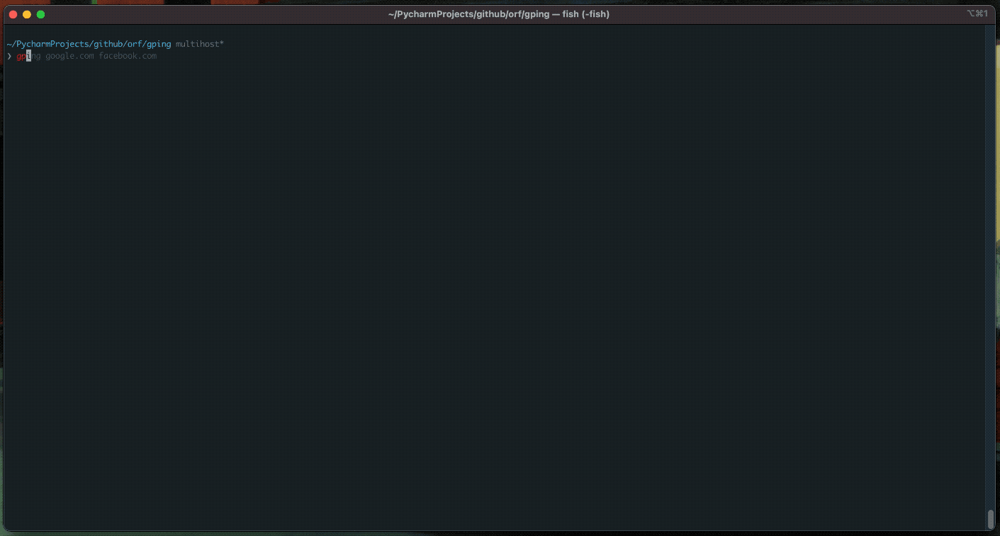

# gping 🚀

[](https://crates.io/crates/gping)
[](https://github.com/orf/gping/actions)

Ping, but with a graph.



Table of Contents
=================

   * [Install :cd:](#install-cd)
      * [Homebrew (MacOS   Linux)](#homebrew-macos--linux)
      * [Binaries (Windows)](#binaries-windows)
      * [Cargo](#cargo)
   * [Usage :saxophone:](#usage-saxophone)

# Install :cd:

**FYI:** The old Python version can be found under the [`python` tag](https://github.com/orf/gping/tree/python).

## Homebrew (MacOS + Linux)

`brew tap orf/brew`, then `brew install gping`

## Binaries (Windows)

Download the latest release from [the github releases page](https://github.com/orf/gping/releases). Extract it 
and move it to a directory on your `PATH`.

## Cargo

`cargo install gping`

# Usage :saxophone:

Just run `gping [host]`.

```
$ gping --help
gping 0.1.0
Ping, but with a graph.

USAGE:
    gping <host>

FLAGS:
    -h, --help       Prints help information
    -V, --version    Prints version information

ARGS:
    <host>    Host or IP to ping
```
